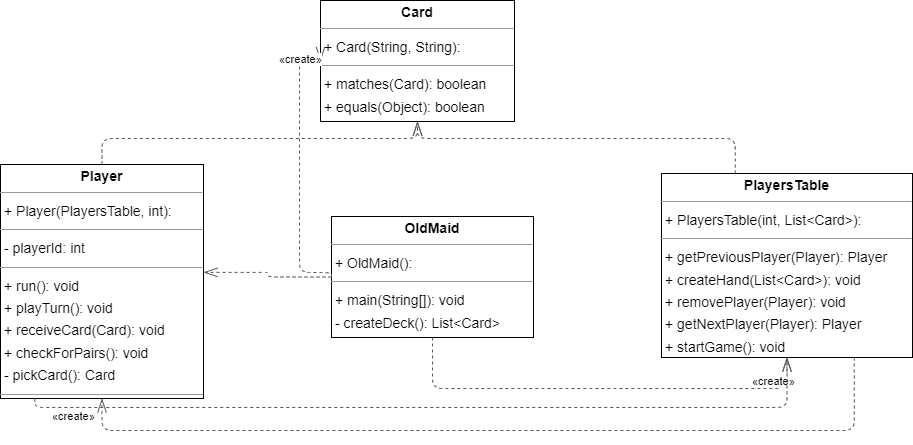

## Object-Oriented Design:

1. Class Structure:
   
- OldMaid: This is the main driver class that initializes the game. It creates the deck of cards and sets up the players.
- PlayersTable: Represents the game table where players are seated. It manages players, player turns, card distribution, and the removal of players from the game.
- Card: Represents a playing card. It contains properties for value and suit and provides functionality to check if two cards are a matching pair.
- Player: Extends the Thread class. Each player is represented as an individual thread, managing their hand of cards and taking actions when it's their turn.

2. Encapsulation and Abstraction:
   
- All classes encapsulate the state (data) and behavior (methods) appropriate to their representations.
- Methods like `matches()` in the `Card` class or `checkForPairs()` in the `Player` class abstract the logic, making the main flow easier to understand.

## Thread Synchronization Mechanisms:

1. Use of synchronized:
- Player actions and game-state changes are synchronized on the `PlayersTable` object to ensure thread safety and prevent race conditions.
- The receiveCard and pickCard methods in the Player class are synchronized to avoid simultaneous modifications to a player's hand.

2. Use of wait/notify mechanism:
- Players (threads) that are not in their turn are kept in a waiting state using the wait() method, thanks to the internal isMyTurn variable each player possesses.
- When a player finishes their turn, the notifyAll() method wakes up the other waiting threads to check if it's their turn.
- A player, while still holding cards, waits for its turn to play. If it isn't their turn (isMyTurn = false), the player waits. Once it becomes their turn, they take a card from the previous player, check and discard any pairs, then relinquishes their turn by setting isMyTurn to false and allowing the next player to play. They then use the notifyAll() method to inform all players of the change in state. This cycle ensures that only the player with isMyTurn = true will execute its play logic, while others will be in a waiting state.
- Upon a player emptying their hand of cards, within a synchronized block, they request their removal from the PlayersTable. Consequently, the respective thread terminates.

3.Game End Condition:
The game continues until only one player (thread) remains. This last-standing player, still holding the Joker, is considered the loser of the game.

## Code Defense using Clean Code Principles:

1. Meaningful Names: Class and variable names are descriptive and reflect their purpose, e.g., PlayersTable, playerId, hand.

2. Functions Do One Thing: Methods are modular and perform a single task. For instance, the checkForPairs() method in the Player class solely focuses on removing pairs from a player's hand.

3. Avoiding Nested Loops: Though nested loops are used in the checkForPairs() method, they're necessary for this logic. The use of the ‘OUTER_LOOP’ label helps break back to that loop when necessary, clarify the loop's purpose and improve readability.

4. Error Handling: The run() method of the Player class includes a try-catch block to handle InterruptedException, ensuring the game doesn't crash from unexpected thread interruptions.

5. Comments and Structure: The code largely speaks for itself, which adheres to Uncle Bob's principle of using comments judiciously. The structure of the code, with separate classes and meaningful method names, makes the code self-explanatory.

6. Single Responsibility Principle (SRP):
- The Card class represents a playing card. It has methods related only to its properties and a matching mechanism.
- The Player class is focused on player behavior, like playing turns, receiving cards, and discarding pairs.
- The PlayersTable class manages the list of players and handles card distribution.

7. Dependency Inversion Principle (DIP): The Player class is a good example of the DIP as it doesn't rely on a concrete PlayersTable, but rather an abstracted structure that manages players. This means if the underlying mechanism for handling players changes, the Player class won't be affected.

